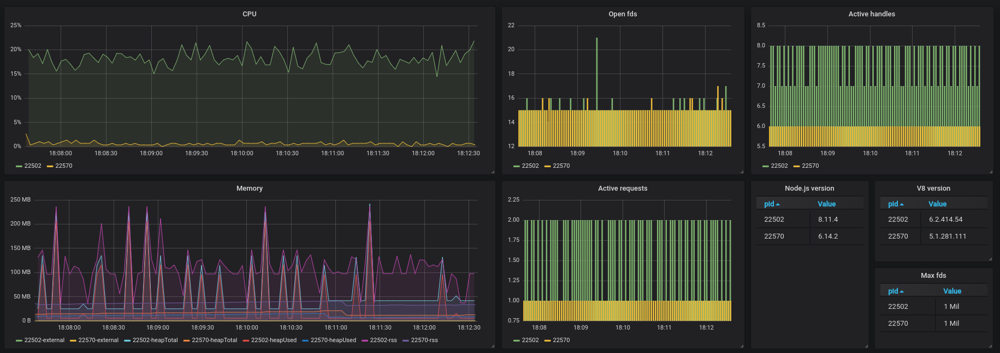
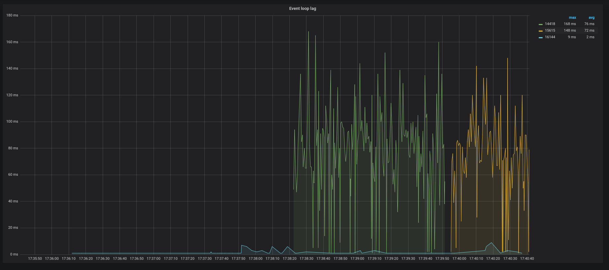

Setup your own metrics configuration! Event loop's metrics included.


## Requirements
- Docker
- Node >= v6


## Setup
Run the following in your terminal
```
$ ./setup.sh
```

You should see something like the following

```
Initializing InfluxDB...
Creating database...
Initializing Grafana...
Configuration is done!
```

<details> 
<summary>Check here for steps on how to do it manually</summary>

1. Run InfluxDB:

```
docker run -d -p 8086:8086 --net nodejs-metrics --name nodejs-influx-metrics influxdb
```

2. Initiliaze InfluxDB:
```
$ curl -XPOST 'http://localhost:8086/query' --data-urlencode 'q=CREATE DATABASE "mydb"'
```
3. Run Grafana
```
$ docker run -d --name=nodejs-grafana-metrics -v $PWD/grafana/config.ini:/etc/grafana/config.ini -v $PWD/grafana/provisioning:/etc/grafana/provisioning -v $PWD/grafana/dashboards:/var/lib/grafana/dashboards --net nodejs-metrics -p 3000:3000 grafana/grafana
```
3. Run `npm link` in this directory and then in your app directory run `npm link metrics`
4. Run any Node app with metrics enabled: `node -r metrics myapp.js`

</details>


You can toggle metrics for a specific process with this command `kill -s USR2 pid`.

## Screenshots

